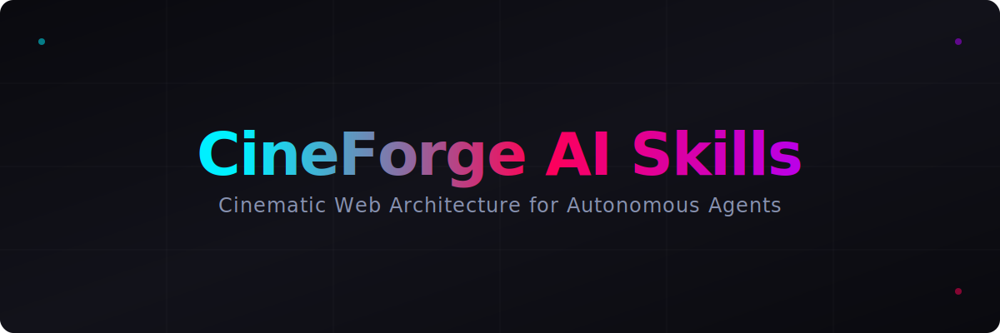

# CineForge AI Skills



> **Installable creative-web skills for AI coding agents — GSAP, Three.js, WebGL, PixiJS, cinematic typography, scroll experiences, shaders and VFX.**

[](https://opensource.org/licenses/MIT)
[](https://github.com/Priyanshuf1/cineforge-ai-skills/actions)

CineForge provides a skill library that teaches AI coding agents to build cinematic, animated, anime-inspired, and real-time 3D web experiences.

> [!WARNING]
> **Status: BETA**
> This repository is currently undergoing hardening for v0.1.0. Some skills are marked as EXPERIMENTAL. Do not use shell installers blindly without inspecting them.

## Features
- **33 Canonical Skills**: Covering everything from typography to GLSL shaders.
- **Agent Adapters**: Adapters for Antigravity, Claude Code, and Gemini CLI.
- **Cross-Platform CLI**: Safe installation with backups, dry-runs, and validation.

## Support Status & Compatibility

| Agent | Status | Notes |
|-------|--------|-------|
| Antigravity | BETA | Utilizes standard skills loading directory |
| Claude Code | EXPERIMENTAL | In development |
| Gemini CLI | EXPERIMENTAL | In development |

| OS | Supported |
|----|-----------|
| Ubuntu / Linux | :white_check_mark: |
| Windows | :white_check_mark: |
| macOS | :white_check_mark: |

## Installation

### Method 1: Clone and Run (Recommended)
```bash
git clone https://github.com/Priyanshuf1/cineforge-ai-skills.git
cd cineforge-ai-skills
npm ci
npm run setup
```

### Method 2: Target Commands
```bash
npm run install:antigravity
```

### Method 3: CLI
```bash
cineforge install --target antigravity --preset cinematic-web
```

### Method 4: Shell Installers (macOS/Linux)
> [!CAUTION]
> Inspect the `install.sh` script before running. Do not use raw branch paths for production environments. Prefer versioned releases (e.g. `v0.1.0`).
```bash
curl -sSL https://raw.githubusercontent.com/Priyanshuf1/cineforge-ai-skills/v0.1.0/installers/install.sh | bash
```

### Method 5: PowerShell Installers (Windows)
> [!CAUTION]
> Inspect the `install.ps1` script before running. Do not use raw branch paths for production environments. Prefer versioned releases (e.g. `v0.1.0`).
```powershell
iwr https://raw.githubusercontent.com/Priyanshuf1/cineforge-ai-skills/v0.1.0/installers/install.ps1 -useb | iex
```

## Available Presets

Defined in `registry/presets.json`. Pass preset name to `--preset`:

- `cinematic-web` — Cinematic scroll, typography, camera (EXPERIMENTAL)
- `anime-vfx` — Impact frames, particle systems, slashes (EXPERIMENTAL)
- `threejs-starter` — R3F, shaders, cel-shading, 3D models (EXPERIMENTAL)
- `performance` — Responsive scene, VFX, glTF optimization (EXPERIMENTAL)

> [!NOTE]
> All presets are EXPERIMENTAL in v0.1.0. Stable releases require full example verification.

## Documentation
Full documentation is available at [https://Priyanshuf1.github.io/cineforge-ai-skills](https://Priyanshuf1.github.io/cineforge-ai-skills).

## Contributing
Please see our [CONTRIBUTING.md](./CONTRIBUTING.md) for details on how to add new skills or agent adapters.

## Disclaimer
This is an unofficial community project and is not affiliated with Google, Anthropic, OpenAI, GSAP, or Three.js.
